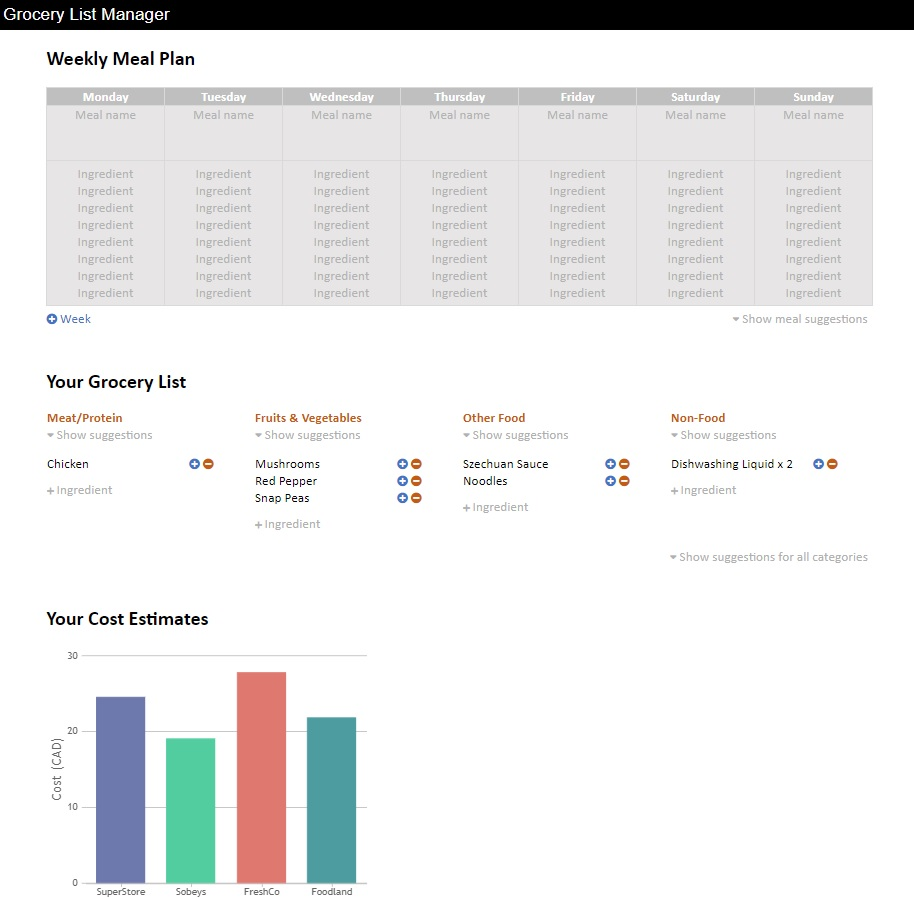
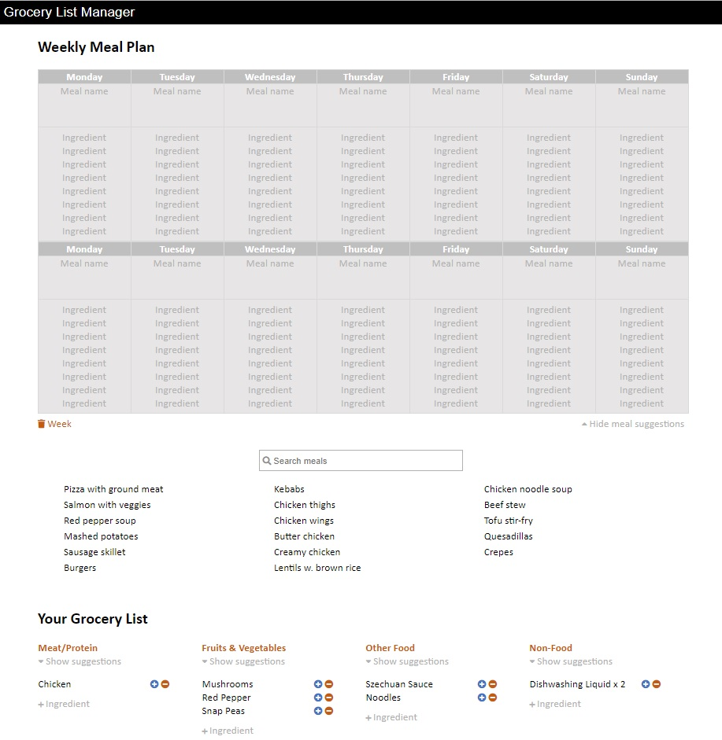

# Grocery List Manager
## A React app that will manage a weekly meal plan, generate a grocery list, and display cost estimates from various stores.
This project is actively under construction. You can view the latest version of the app [here](https://grocery-list-react.herokuapp.com) and follow along the project progress [here](https://github.com/fateeq/groceryList-reactJS/projects).


**Main Features To Be Implemented:**
- A **calendar** showing the meal plan for one, or optionally two weeks.
- A **grocery list** generated automatically based on the meal plan.
- **Cost estimates** from multiple stores for the generated grocery list.

**Mockups**




**Folder Structure**
```
/src
   /App
      /common
         /SectionTitle.js
      /CostEstimates
         CostEstimates.js
      /GroceryList
         /List
            List.js
            AddIngredient.js
            AddQty.js
            RmvQty.js
            ShowIngredientSuggestions.js
         GroceryList.js
         ShowAllIngredients.js
      /MealPlan
         /MealSuggestions
            MealsList.js
            MealSuggestions.js
            SearchBar.js
         /ToggleMealSuggestions
            HideMealSuggestions.js
            ShowMealSuggestions.js
            ToggleMealSuggestions.js
         AddWeek.js
         Calendar.js
         MealPlan.js
      App.js
      App.css
   /data
      meals.js
   index.js
   index.css
```
